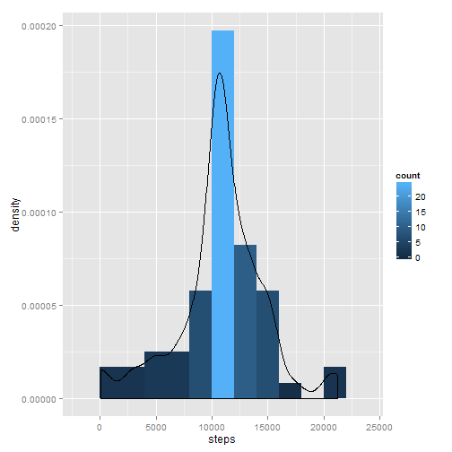

## Loading and preprocessing the data

The activity data is loaded from the file *activity.csv* contained within the ZIP-archive *archive.zip* found in the working directory.


```r
df=read.csv(unz("activity.zip", 
                "activity.csv"
                ), 
            header=T, 
            colClasses=c("integer", 
                         "POSIXct", 
                         "integer"
                         )
            )
```

Let's have a look at the summary of the data.


```r
summary(df)
```

```
##      steps             date                        interval     
##  Min.   :  0.00   Min.   :2012-10-01 00:00:00   Min.   :   0.0  
##  1st Qu.:  0.00   1st Qu.:2012-10-16 00:00:00   1st Qu.: 588.8  
##  Median :  0.00   Median :2012-10-31 00:00:00   Median :1177.5  
##  Mean   : 37.38   Mean   :2012-10-30 23:32:27   Mean   :1177.5  
##  3rd Qu.: 12.00   3rd Qu.:2012-11-15 00:00:00   3rd Qu.:1766.2  
##  Max.   :806.00   Max.   :2012-11-30 00:00:00   Max.   :2355.0  
##  NA's   :2304
```

It appears there are quite a few missing values in the *steps* column. This amounts to 13.11 %, so we might have to impute the missing values later on.


## What is mean total number of steps taken per day?

To find out what the mean total number of steps per day is, I aggregate the number of steps over the date using sum function.


```r
df.agg <- aggregate(steps~date, data=df, sum)
```

To get a better overview, let's plot this data.


```r
Sys.setlocale("LC_TIME", "C")
```

```
## [1] "C"
```

```r
library(ggplot2)
p1 <- qplot(date, steps, data = df.agg) 
p1 <- p1 + geom_smooth()
p1
```

 

We can already see that the average number of steps is somewhere around 11000. To further explore that point, let's look at the histogram.


```r
library(ggplot2)
p2 <- ggplot(df.agg, aes(x=steps)) 
p2 <- p2 + geom_histogram(binwidth = 2000, aes(y = ..density.., fill = ..count..)) 
p2 <- p2 + geom_density()
p2
```

 

The mean number of steps taken per day is:


```r
mean(df.agg$steps)
```

```
## [1] 10766.19
```


The median of the number of steps taken per day is:


```r
median(df.agg$steps)
```

```
## [1] 10765
```


## What is the average daily activity pattern?

To examine the average daily activity pattern, we first have to aggregate the steps by the interval.


```r
df.agg2 <- aggregate(steps~interval, data=df, mean)
```

In addition, it would be helpful to have a properly formatted time field for later inspection of the time series. To arrive at this new field, the interval is divided by 100 which gives us the necessary separation character to further disect hours and minutes and format the result into a proper time field. Note that as a side effect, the date will be set to today's date, which does not matter since only the time portion is used in the time series plot later on.


```r
df.agg2$time <- as.POSIXct(
                  formatC(df.agg2$interval / 100, 
                          2, 
                          format='f'
                          ),
                  format='%H.%M', 
                  tz='GMT'
                )
```

Let's have a look a the time series of the steps per interval.


```r
Sys.setlocale("LC_TIME", "C")
```

```
## [1] "C"
```

```r
library(ggplot2)
library(scales)
p3 <- qplot(time, steps, data = df.agg2) 
p3 <- p3 + geom_line() 
p3 <- p3 + scale_x_datetime(labels=date_format(format='%H:%M'))
p3
```

 

To directly determine which 5-minute interval is the one containing the most steps on average across all days, I sort the aggregated dataset by the steps in descending order and return the first row.


```r
head(df.agg2[order(-df.agg2$steps), ], 1)
```

```
##     interval    steps                time
## 104      835 206.1698 2015-05-13 08:35:00
```


## Imputing missing values

Let's return to the topic of the missing values in the steps column.

First, let's have a look at the summary of the data.


```r
summary(df$steps)
```

```
##    Min. 1st Qu.  Median    Mean 3rd Qu.    Max.    NA's 
##    0.00    0.00    0.00   37.38   12.00  806.00    2304
```

For imputation, let's create a copy of the original data frame *df*, merge the aggregated data frame *df.agg2* by interval to it and call it *df.imp*. The resulting data frame will have columns called steps.x (the original steps values) and steps.y (the average step values of that interval), since the original steps column is present in both data frames. Using the ifelse() function, a new column called steps will be created. If steps.x is NA, then the average for that interval will be used, else the original value will be used.


```r
df.imp <- merge(df, df.agg2, by = c("interval"))
df.imp$steps <- ifelse(is.na(df.imp$steps.x), df.imp$steps.y, df.imp$steps.x)
```

Let's take a look at the mean and median for the original and the imputed data.


```r
df.imp.agg <- aggregate(steps~date, data=df.imp, sum)
mean(df.agg$steps)
```

```
## [1] 10766.19
```

```r
mean(df.imp.agg$steps)
```

```
## [1] 10766.19
```

```r
median(df.agg$steps)
```

```
## [1] 10765
```

```r
median(df.imp.agg$steps)
```

```
## [1] 10766.19
```

While the mean values have not changed after imputation, the median increased slightly.


```r
summary(df.imp$steps)
```

```
##    Min. 1st Qu.  Median    Mean 3rd Qu.    Max. 
##    0.00    0.00    0.00   37.38   27.00  806.00
```

Looking at the summary above, it is interesting to see that the 3rd quartile has risen quite considerably.

Let's have a look a the data plot of the imputed data set next to the original one from above.


```r
Sys.setlocale("LC_TIME", "C")
```

```
## [1] "C"
```

```r
library(ggplot2)
p4 <- qplot(date, steps, data = df.imp.agg) 
p4 <- p4 + geom_smooth()
p4
```

 

Superficial inspection of the above plot reveals hardly any deviation from the original data (apart from the plot now starting at Oct 1st and ending at Nov 30th, which perviously was all NAs), so let us now turn to the histogram of the imputed data.


```r
library(ggplot2)
p5 <- ggplot(df.imp.agg, aes(x=steps)) 
p5 <- p5 + geom_histogram(binwidth = 2000, aes(y = ..density.., fill = ..count..)) 
p5 <- p5 + geom_density()
p5
```

 

The height of the 10000-12000 bin has increased considerably, which is probably the result of the imputation with the average steps values that reinforced the already existing distribution.

## Are there differences in activity patterns between weekdays and weekends?

To address this question, I will first add a new factor variable containing the classifier *daytype* to the imputed dataset. To do this, I will create a function handling the logic based on the date input and apply the result.


```r
daytype <- function(d) {
Sys.setlocale("LC_TIME", "C")
    if (weekdays(d) %in% c('Saturday', 'Sunday')) {
        return('weekend')
    } else {
        return('weekday')
    }
}
```

The new column is created like this:


```r
df.imp$daytype <- as.factor(sapply(df.imp$date, daytype))
head(df.imp)
```

```
##   interval steps.x       date  steps.y       time    steps daytype
## 1        0      NA 2012-10-01 1.716981 2015-05-13 1.716981 weekday
## 2        0       0 2012-11-23 1.716981 2015-05-13 0.000000 weekday
## 3        0       0 2012-10-28 1.716981 2015-05-13 0.000000 weekend
## 4        0       0 2012-11-06 1.716981 2015-05-13 0.000000 weekday
## 5        0       0 2012-11-24 1.716981 2015-05-13 0.000000 weekend
## 6        0       0 2012-11-15 1.716981 2015-05-13 0.000000 weekday
```

To be able to tell the difference between weekdays and weekends, I aggregate the data like this:


```r
df.imp.agg2 <- aggregate(steps ~ time + daytype, data = df.imp, mean)
```

To compare the difference between weekdays and weeknds, I plot the timeseries based on the aggregated data, adding a facet grid separating the data by the *daytype*.


```r
library(ggplot2)
p6 <- qplot(time, steps, data = df.imp.agg2) 
p6 <- p6 + geom_line() 
p6 <- p6 + facet_grid(daytype ~ .)
p6 <- p6 + scale_x_datetime(labels=date_format(format='%H:%M'))
p6
```

 

Looking at both of the time series in the above plot, it appears that people tend to get up later on weekends in addition to being longer in the evening hours. On weekdays, the peak right before 9:00 a.m. is much more pronounced than it is on weekends, probably because people are rushing to work at that time of the day.
